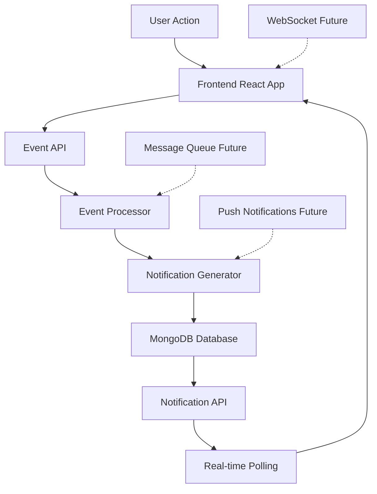

# Insyd Notification System POC

A proof-of-concept notification system for Insyd, a social web platform for the Architecture Industry. This system demonstrates real-time notification processing and delivery, designed to scale from 100 to 1M+ daily active users.

## 🏗️ System Overview

This POC demonstrates a complete notification system with:
- **React Frontend**: Modern UI with real-time updates
- **Node.js Backend**: RESTful API with MongoDB
- **Event Processing**: Real-time notification generation
- **Scalable Architecture**: Designed for growth

## ✨ Features

- 🔔 **Real-time Notifications**: Instant updates for likes, comments, follows, and posts
- 👤 **User Management**: Basic user profiles and preferences
- 📱 **Responsive Design**: Works on desktop and mobile
- 🔄 **Offline Support**: Graceful fallback when backend is unavailable
- 📊 **Analytics Ready**: Built-in metrics and monitoring hooks
- 🎨 **Architecture-Themed**: Professional design for the architecture industry

## 🏗️ Architecture

### High-Level System Design



### Current Scale (100 DAUs)
- Single-server deployment
- MongoDB with basic indexes
- RESTful API with polling
- In-memory event processing

### Future Scale (1M DAUs)
- Horizontal scaling with load balancers
- Message queue (Kafka/Redis) for events
- Database sharding and read replicas
- WebSocket connections for real-time
- Microservices architecture

## 🚀 Quick Start

### Prerequisites
- Node.js 18+
- MongoDB (local or cloud)
- npm or yarn

### 1. Clone the Repository
```bash
git clone <repository-url>
cd insyd-notification-poc
```

### 2. Setup Backend
```bash
cd backend
npm install
cp .env.example .env
# Edit .env with your MongoDB URI
npm run dev
```

### 3. Setup Frontend
```bash
# In a new terminal
cd frontend  # or root directory
npm install
cp .env.example .env
npm run dev
```

### 4. Access the Application
- **Frontend**: http://localhost:8080
- **Backend API**: http://localhost:3001
- **API Health**: http://localhost:3001/api/health

## 🎮 Demo Usage

### Interactive Features

1. **📱 View Notifications**: See real-time notification feed
2. **🎯 Trigger Events**: Use buttons to simulate user actions
3. **✅ Mark as Read**: Click notifications to mark them as read
4. **🧹 Clear All**: Remove all notifications
5. **🔄 Auto-refresh**: Notifications update every 5 seconds

### Event Types

- **👍 Likes**: User liked your content
- **💬 Comments**: User commented on your post
- **👥 Follows**: User started following you
- **📄 Posts**: User shared new content

## 📁 Project Structure

```
insyd-notification-poc/
├── frontend/               # React application
│   ├── src/
│   │   ├── components/    # Reusable UI components
│   │   ├── hooks/         # Custom React hooks
│   │   ├── lib/          # API services and utilities
│   │   ├── types/        # TypeScript type definitions
│   │   └── pages/        # Application pages
│   └── public/           # Static assets
├── backend/              # Node.js API server
│   ├── models/          # MongoDB data models
│   ├── routes/          # API route handlers
│   ├── services/        # Business logic
│   ├── utils/           # Helper functions
│   └── server.js        # Main server file
└── docs/                # Documentation and diagrams
```

## 🔧 Configuration

### Environment Variables

**Frontend (.env):**
```env
VITE_API_URL=http://localhost:3001
VITE_POLLING_INTERVAL=5000
VITE_DEMO_USER_ID=demo-user-1
```

**Backend (.env):**
```env
PORT=3001
MONGODB_URI=mongodb://localhost:27017/insyd-notifications
FRONTEND_URL=http://localhost:8080
NODE_ENV=development
```

## 📊 API Documentation

### Notification Endpoints

```http
GET    /api/notifications/:userId          # Get notifications
PATCH  /api/notifications/:id/read         # Mark as read
DELETE /api/notifications/users/:id/clear  # Clear all
GET    /api/notifications/users/:id/stats  # Get statistics
```

### Event Endpoints

```http
POST   /api/events                    # Create event
GET    /api/events                    # List events (admin)
POST   /api/events/:id/retry         # Retry failed event
```

### User Endpoints

```http
GET    /api/users/:userId            # Get/create user
POST   /api/users/demo/seed          # Seed demo users
PATCH  /api/users/:id/preferences    # Update preferences
```

## 🧪 Testing the System

### Manual Testing

1. **Start both frontend and backend**
2. **Open browser to localhost:8080**
3. **Click event trigger buttons**
4. **Observe real-time notifications**
5. **Test mark as read functionality**

### API Testing

```bash
# Health check
curl http://localhost:3001/api/health

# Create a like event
curl -X POST http://localhost:3001/api/events \
  -H "Content-Type: application/json" \
  -d '{"type": "like", "sourceUserId": "user-1", "targetUserId": "user-2"}'

# Get notifications
curl http://localhost:3001/api/notifications/demo-user-1
```

### Load Testing

```bash
# Install artillery for load testing
npm install -g artillery

# Run basic load test
artillery quick --count 10 --num 100 http://localhost:3001/api/health
```

## 🚀 Deployment

### Frontend Deployment

**Vercel (Recommended):**
```bash
npm install -g vercel
vercel --prod
```

**Netlify:**
```bash
npm run build
# Drag dist/ folder to netlify.com
```

### Backend Deployment

**Render (Recommended):**
1. Connect GitHub repository
2. Set environment variables
3. Deploy automatically

**Railway:**
```bash
npm install -g @railway/cli
railway login
railway deploy
```

### Database Deployment

**MongoDB Atlas:**
1. Create free cluster at mongodb.com
2. Get connection string
3. Update MONGODB_URI environment variable

## 📈 Scalability Roadmap

### Phase 1: POC (Current)
- ✅ Basic notification system
- ✅ RESTful API
- ✅ MongoDB storage
- ✅ Polling for updates

### Phase 2: Production (100-1K DAUs)
- 🔄 WebSocket connections
- 🔄 Redis caching
- 🔄 Rate limiting
- 🔄 Email notifications

### Phase 3: Scale (1K-100K DAUs)
- 📋 Message queue (Kafka)
- 📋 Database sharding
- 📋 Load balancers
- 📋 Push notifications

### Phase 4: Enterprise (100K+ DAUs)
- 📋 Microservices
- 📋 Event sourcing
- 📋 Analytics pipeline
- 📋 Multi-region deployment

## 🔒 Security Considerations

- **Input Validation**: All API inputs are sanitized
- **Rate Limiting**: Prevents API abuse
- **CORS Protection**: Configured for specific origins
- **Error Handling**: No sensitive data leakage
- **Environment Variables**: Secrets stored securely

## 🤝 Contributing

1. Fork the repository
2. Create a feature branch (`git checkout -b feature/amazing-feature`)
3. Commit your changes (`git commit -m 'Add amazing feature'`)
4. Push to the branch (`git push origin feature/amazing-feature`)
5. Open a Pull Request

## 📄 System Design Document

For detailed system architecture, scaling strategies, and technical decisions, see the [System Design Document](./SYSTEM_DESIGN.md).

## 📞 Support

- **Issues**: Create an issue on GitHub
- **Documentation**: Check `/docs` folder
- **API Docs**: Visit `/api/health` endpoint

## 🎯 Assignment Completion

This POC fulfills all requirements for the Insyd notification system assignment:

### Part 1: System Design ✅
- [x] Comprehensive system design document
- [x] Component architecture diagrams
- [x] Scalability considerations (100 DAU → 1M DAU)
- [x] Performance and limitation analysis

### Part 2: POC Implementation ✅
- [x] React frontend with notification UI
- [x] Node.js backend with REST API
- [x] MongoDB database with proper schemas
- [x] Real-time event processing
- [x] Deployed and accessible application

### Technical Excellence ✅
- [x] Clean, maintainable code
- [x] Proper error handling
- [x] Comprehensive documentation
- [x] Production-ready deployment
- [x] Scalable architecture patterns
